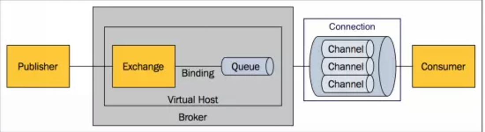
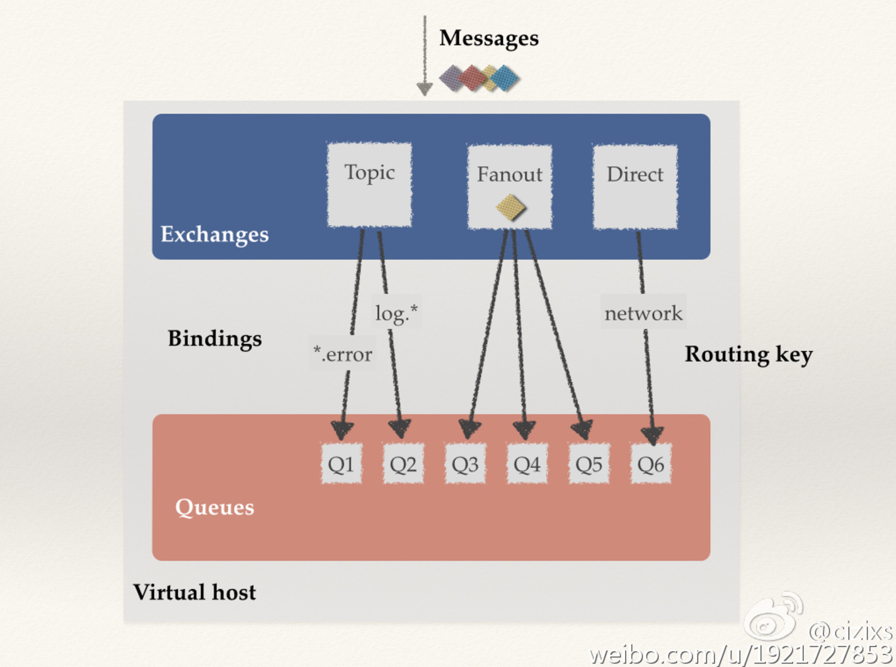
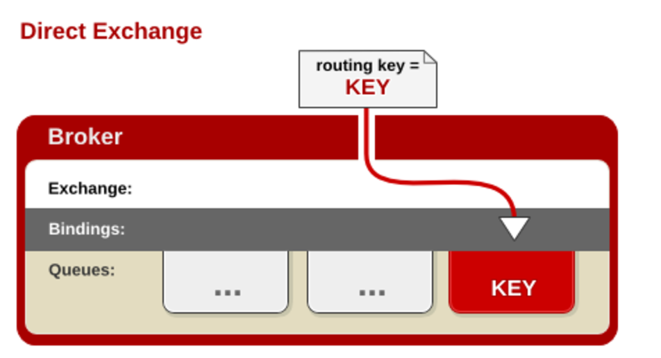
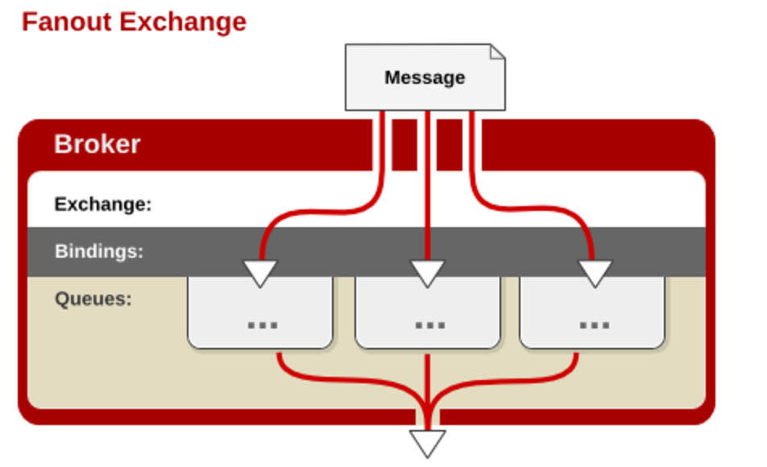
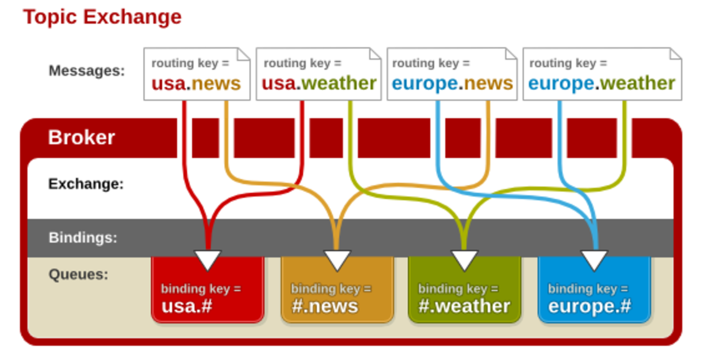

### AMQP messaging 中的基本概念



* Broker: 消息队列服务器实体
接收和分发消息的应用，RabbitMQ Server就是Message Broker。

* vhost/Virtual host: 出于多组户和安全因素设计的，把AMQP的基本组件划分到一个虚拟的分组中，类似于网络中的namespace概念。
**当多个不同的用户使用同一个RabbitMQ server提供的服务时，可以划分出多个vhost，每个用户在自己的vhost创建exchange／queue等**。

* Connection: publisher／consumer和broker之间的TCP连接。`断开连接的操作只会在client端进行`，
Broker不会断开连接，除非出现网络故障或broker服务出现问题。

* Channel: 如果每一次访问RabbitMQ都建立一个Connection，在消息量大的时候建立TCP Connection的开销将是巨大的，效率也较低。<br>Channel是在connection内部建立的逻辑连接，如果应用程序支持多线程，通常每个thread创建单独的channel进行通讯，<br>AMQP method包含了channel id帮助客户端和message broker识别channel，所以channel之间是完全隔离的。<br> Channel作为轻量级的Connection极大减少了操作系统建立TCP connection的开销。

* Exchange: 消息交换机，它指定消息按什么规则，路由到哪个队列
message到达broker的第一站，根据分发规则，匹配查询表中的routing key，分发消息到queue中去。<br> 常用的类型有：direct (point-to-point), topic (publish-subscribe) and fanout (multicast)。

* Queue: 消息队列载体，每个消息都会被投入到一个或多个队列
消息最终被送到这里等待consumer取走。一个message可以被同时拷贝到多个queue中。

* Binding: 绑定，它的作用就是把exchange和queue按照路由规则绑定起来
exchange和queue之间的虚拟连接，binding中可以包含routing key。Binding信息被保存到exchange中的查询表中，用于message的分发依据。

#### 其他概念
* Routing Key：路由关键字，exchange根据这个关键字进行消息投递
* producer：消息生产者，就是投递消息的程序。
* consumer：消息消费者，就是接受消息的程序。
* channel：消息通道，在客户端的每个连接里，可建立多个channel，每个channel代表一个会话任务

## 消息队列的使用过程大概如下：
（1）客户端连接到消息队列服务器，打开一个channel。
（2）客户端声明一个exchange，并设置相关属性。
（3）客户端声明一个queue，并设置相关属性。
（4）客户端使用routing key，在exchange和queue之间建立好绑定关系。
（5）客户端投递消息到exchange。
exchange接收到消息后，就根据消息的key和已经设置的binding，进行消息路由，将消息投递到一个或多个队列里。


### Exchange 类型

#### direct


1.一般情况可以使用rabbitMQ自带的Exchange：”"(该Exchange的名字为空字符串，下文称其为default Exchange)。

2.这种模式下不需要将Exchange进行任何绑定(binding)操作

3.消息传递时需要一个“RouteKey”，可以简单的理解为要发送到的队列名字。

4.如果vhost中不存在RouteKey中指定的队列名，则该消息会被抛弃。
#### fanout


1.可以理解为路由表的模式

2.这种模式不需要RouteKey

3.这种模式需要提前将Exchange与Queue进行绑定，一个Exchange可以绑定多个Queue。

4.如果接受到消息的Exchange没有与任何Queue绑定，则消息会被抛弃
#### topic


1.这种模式较为复杂，简单来说，就是每个队列都有其关心的主题，所有的消息都带有一个“标题”(RouteKey)，<br> Exchange会将消息转发到所有关注主题能与RouteKey模糊匹配的队列。

2.这种模式需要RouteKey，也许要提前绑定Exchange与Queue。

3.在进行绑定时，要提供一个该队列关心的主题，如“#.log.#”表示该队列关心所有涉及log的消息(一个RouteKey为”MQ.log.error”的消息会被转发到该队列)。

4.“#”表示0个或若干个关键字，“*”表示一个关键字。如“log.*”能与“log.warn”匹配，无法与“log.warn.timeout”匹配；但是“log.#”能与上述两者匹配。

5.同样，如果Exchange没有发现能够与RouteKey匹配的Queue，则会抛弃此消息

### 来源
```
http://www.cnblogs.com/frankyou/p/5283539.html
http://cizixs.com/2015/11/23/rabbitmq-concept-and-usage
http://hwcrazy.com/34195c9068c811e38a44000d601c5586/be62fc2668c811e3adba000d601c5586/
全的学习地址
http://hwcrazy.com/b5fce358672411e3baa0000d601c5586/group/free_open_source_project/
```
