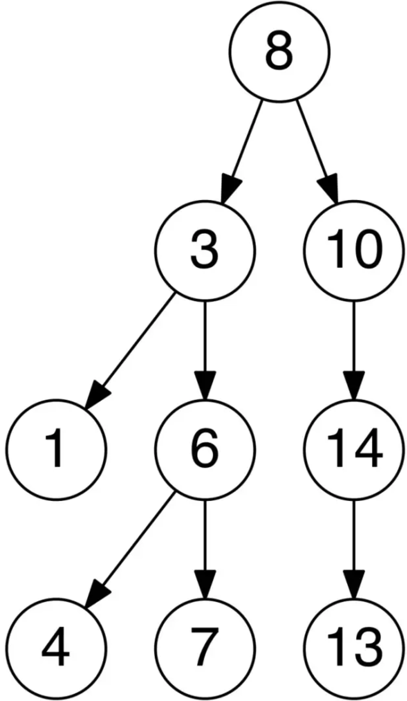
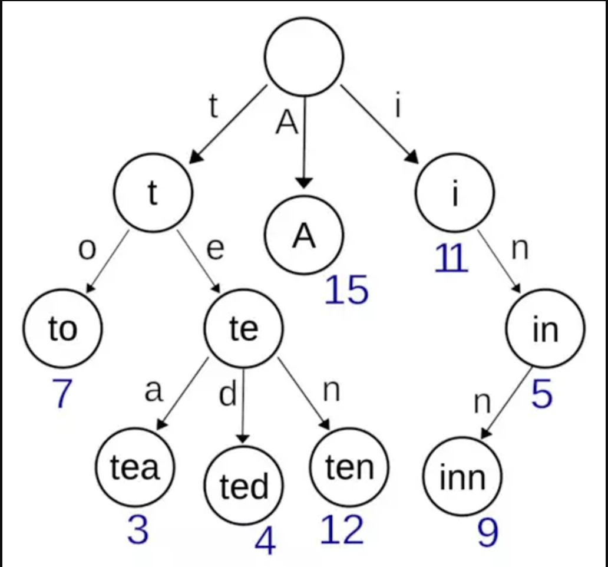
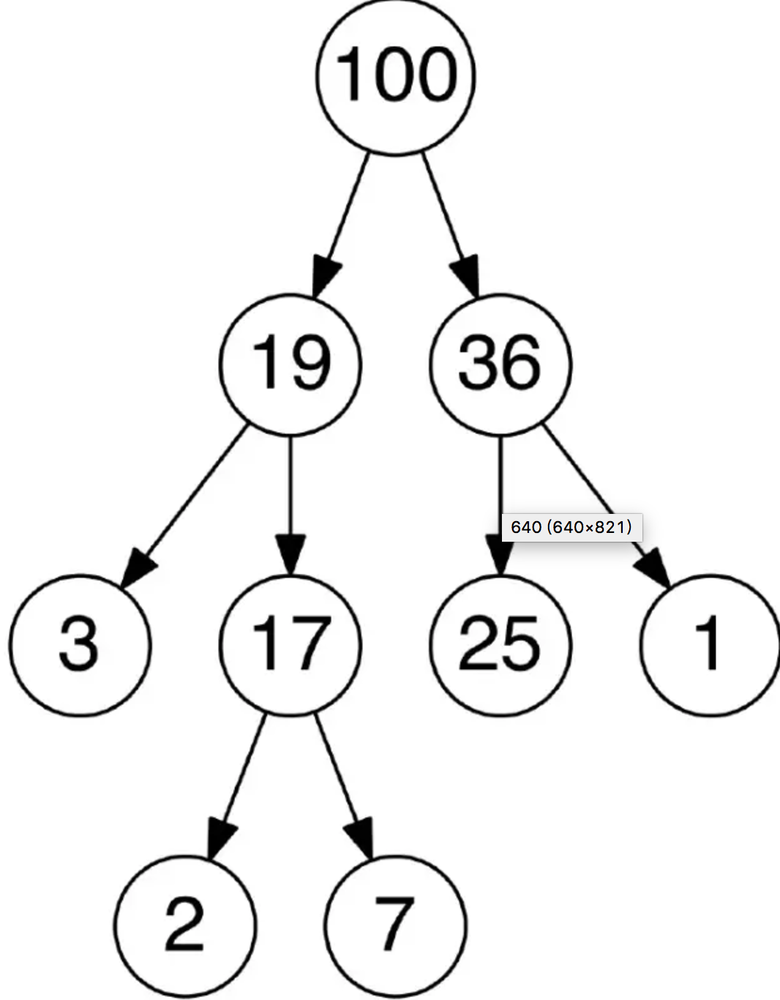
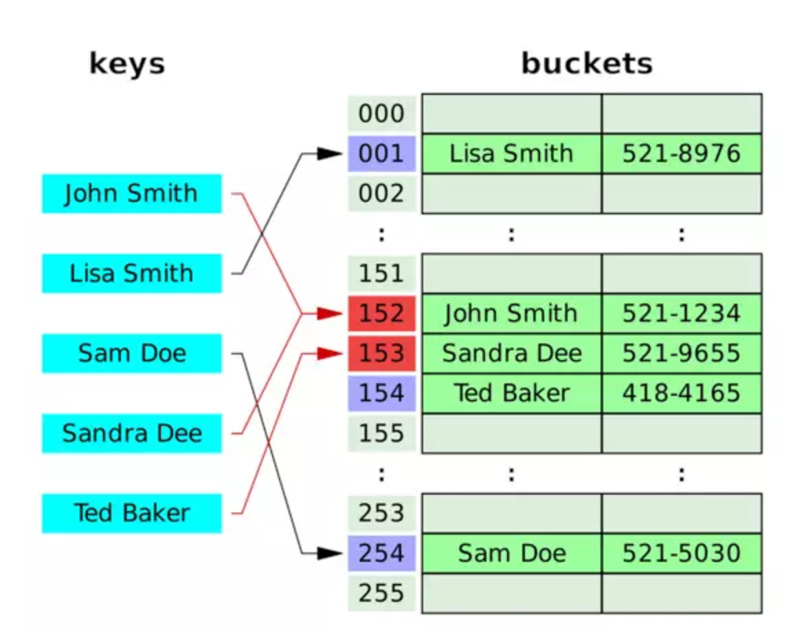
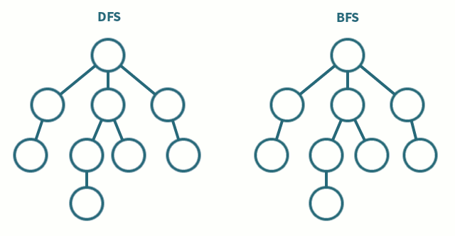
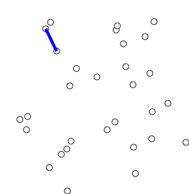

### 链表
* 链表是一种由节点（Node）组成的线性数据集合，每个节点通过指针指向下一个节点。它是一种由节点组成，并能用于表示序列的数据结构。
* 单链表：每个节点仅指向下一个节点，最后一个节点指向空（null）。
* 双链表：每个节点有两个指针p，n。p指向前一个节点，n指向下一个节点；最后一个节点指向空。
* 循环链表：每个节点指向下一个节点，最后一个节点指向第一个节点。
* 时间复杂度：
    索引：O(n)
    查找：O(n)
    插入：O(1)
    删除：O(1)

### 栈
* 栈是一个元素集合，支持两个基本操作：push用于将元素压入栈，pop用于删除栈顶元素。
* 后进先出的数据结构（Last In First Out, LIFO）
* 时间复杂度
    索引：O(n)
    查找：O(n)
    插入：O(1)
    删除：O(1)

### 队列
* 队列是一个元素集合，支持两种基本操作：enqueue 用于添加一个元素到队列，dequeue 用于删除队列中的一个元素。
* 先进先出的数据结构（First In First Out, FIFO）。
* 时间复杂度
    索引：O(n)
    查找：O(n)
    插入：O(1)
    删除：O(1)

# 树
```
树是无向、联通的无环图。
```  
### 二叉树
* 二叉树是一个树形数据结构，每个节点最多可以有两个子节点，称为左子节点和右子节点。
* 满二叉树（Full Tree）：二叉树中的每个节点有 0 或者 2 个子节点。
* 完美二叉树（Perfect Binary）：二叉树中的每个节点有两个子节点，并且所有的叶子节点的深度是一样的。
* 完全二叉树：二叉树中除最后一层外其他各层的节点数均达到最大值，最后一层的节点都连续集中在最左边。  

### 二叉查找树
* 二叉查找树（BST）是一种二叉树。其任何节点的值都大于等于左子树中的值，小于等于右子树中的值。
* 时间复杂度
    索引：O(log(n))
    查找：O(log(n))
    插入：O(log(n))
    删除：O(log(n))


### 字典树
* 字典树，又称为基数树或前缀树，是一种用于存储键值为字符串的动态集合或关联数组的查找树。<br> 树中的节点并不直接存储关联键值，而是该节点在树中的位置决定了其关联键值。<br> 一个节点的所有子节点都有相同的前缀，根节点则是空字符串。


### 堆
* 堆是一种基于树的满足某些特性的数据结构：<br>整个堆中的所有父子节点的键值都满足相同的排序条件。
* 堆分为最大堆和最小堆。
* 在最大堆中，父节点的键值永远大于等于所有子节点的键值，根节点的键值是最大的。
* 最小堆中，父节点的键值永远小于等于所有子节点的键值，根节点的键值是最小的。
* 时间复杂度
    索引：O(log(n))
    查找：O(log(n))
    插入：O(log(n))
    删除：O(log(n))
    删除最大值/最小值：O(1)


### 哈希
* 哈希用于将`任意长度`的数据映射到`固定长度`的数据。哈希函数的返回值被称为哈希值、哈希码或者哈希。如果不同的主键得到相同的哈希值，则发生了冲突。
* Hash Map：hash map 是一个存储键值间关系的数据结构。HashMap 通过哈希函数将键转化为桶或者槽中的下标，从而便于指定值的查找。
###### 冲突解决
* 链地址法（Separate Chaining）：
在链地址法中，每个桶（bucket）是相互独立的，每一个索引对应一个元素列表。<br> 处理HashMap 的时间就是查找桶的时间（常量）与遍历列表元素的时间之和。
* 开放地址法（Open Addressing）：
在开放地址方法中，当插入新值时，会判断该值对应的哈希桶是否存在，<br> 如果存在则根据某种算法依次选择下一个可能的位置，直到找到一个未被占用的地址。开放地址即某个元素的位置并不永远由其哈希值决定。  


### 图
* 图是G =（V，E）的有序对，其包括顶点或节点的集合 V 以及边或弧的集合E，<br> 其中E包括了两个来自V的元素（即边与两个顶点相关联 ，并且该关联为这两个顶点的无序对）。
* 无向图：
图的邻接矩阵是对称的，因此如果存在节点 u 到节点 v 的边，那节点 v 到节点 u 的边也一定存在。
* 有向图：
图的邻接矩阵不是对称的。因此如果存在节点 u 到节点 v 的边并不意味着一定存在节点 v 到节点 u 的边。

### 深度优先搜索
* 深度优先搜索是一种先遍历子节点而不回溯的图遍历算法。
* 时间复杂度：O(|V| + |E|)

### 广度优先搜索
* 广度优先搜索是一种先遍历邻居节点而不是子节点的图遍历算法。
* 时间复杂度：O(|V| + |E|)



### 最小生成树算法
* 最小生成树算法是一种在无向带权图中查找最小生成树的贪心算法。<br> 换言之，最小生成树算法能在一个图中找到连接所有节点的边的最小子集。
* 时间复杂度：O(|V|^2)
*



### 来源地址
[微信](https://mp.weixin.qq.com/s?__biz=MjM5OTA1MDUyMA==&mid=2655438231&idx=1&sn=ad15b381d0e713b6ae02a4461f9c419f&chksm=bd7309e08a0480f67c6a26f6077034ae498ea58500346a915709c1886dc200b81d85553032f8&mpshare=1&scene=1&srcid=0712hcvVo5NAP6HAEn9O1XxK&key=8652b956ca1971a4fd70bf208264f24df4064db0fe8528e3343faced6bd042a8c7e2ce818fdf4b6c1c8270ae2e8362b8948fcdce5f29096198c3e34c335a19a992a5c5c70ffc789b80e6f663f412e088&ascene=0&uin=MjM2MzI4MDU4Mw%3D%3D&devicetype=iMac+MacBookPro11%2C1+OSX+OSX+10.12.5+build)
