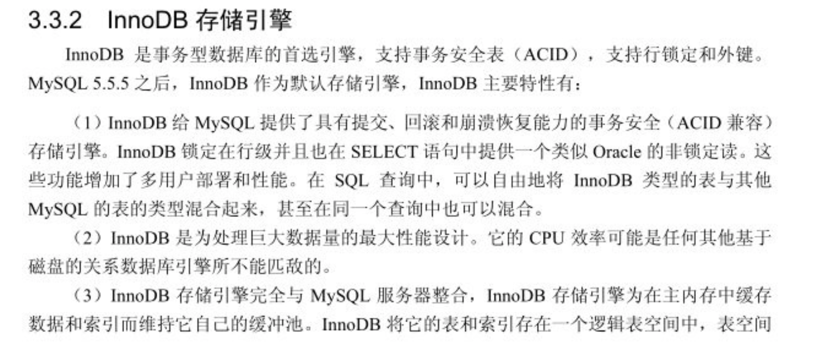
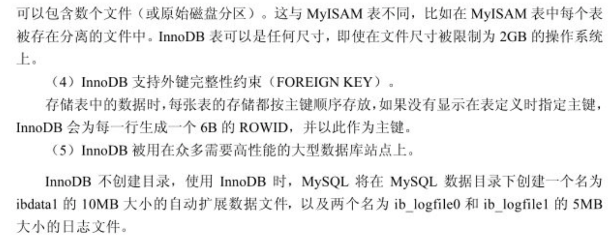
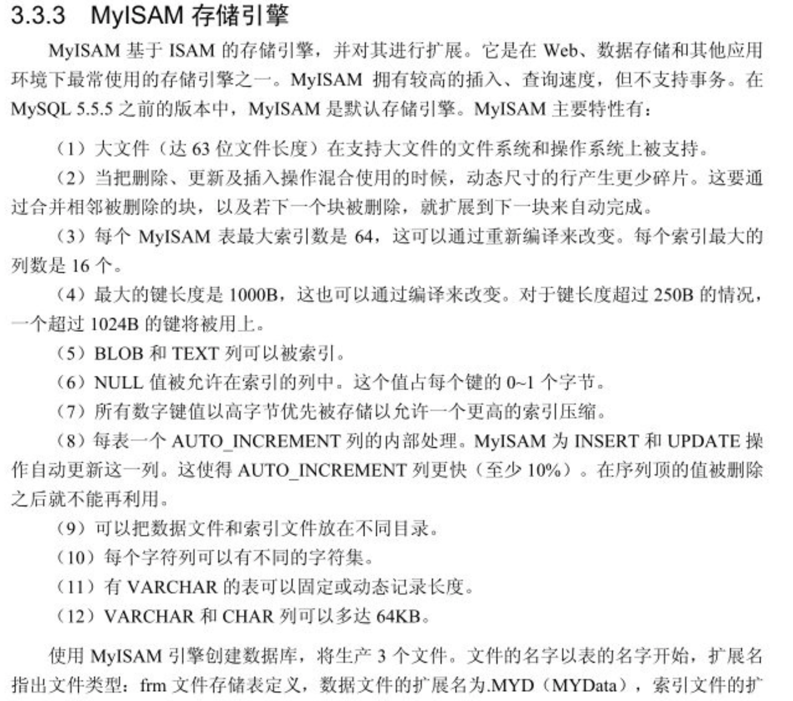

## InnoDB
InnoDB 是事务性数据库首选的存储引擎，支持事务安全表，支持行锁定和外键
* 提供了可以提交、回滚和崩溃回复的书屋安全（ACID），在行锁定的情况下提供为selectti'提供类似于orcale的
    非锁定读
* 是为巨大数据量的最大新能设计，其cpu效率是任何存储引擎不能比的
* 为主内存中缓存数据和索引维持自己的缓冲池
* 支持外键完整性约束

## MyiSAM
具有较高的插入，查询速度，但不支持事务
* 大文件，在支持大文件的文件系统和操作系统被支持
* 再删除和插入等混合操作的时候产生更小的碎片【合并相邻被删除的块】   
* 每个表的最大索引数是64 ，每个索引最大的列是16
* BLOD 和 TEXT可以被索引
* NULL允许被索引，每个值站0~1个字节

## 原文说明

***

