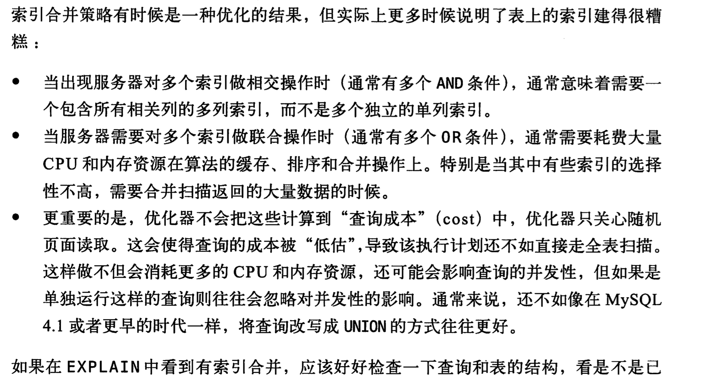

## 优点
* 减少服务器需要扫描的数据量
* 避免服务器排序和临时表
* 将随机的I/O  变化为 顺序I/O

## 高性能索引策略
### 单列索引
只有独立的列才能使用索引，若是表达式不能使用索引

### 索引选择和索引选择性
若是前缀的选择性接近0.031{ count（left（city ， 4））/ count( * ) }就可以使用
添加索引
    alter table table1 add key(city(4));//前四位添加索引

优点：
    索引更小，更快，更有效
缺点：
    order by 和 group by 无法使用前缀索引

### 多列索引

### 选择合适的索引顺序
在多列索引中；索引的顺序按照最 **左边** 的顺序进行；
当不需要考虑排序和分组：
    将选 **择性最高** 的列放在最前面

一般：
将运行频率最高的放在最前面
### 聚聚索引
### 覆盖索引
### 压缩（前缀）索引
### 冗余和重复索引
