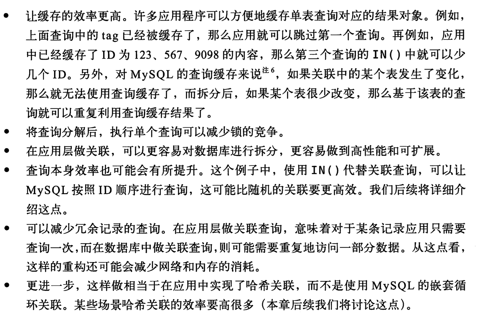
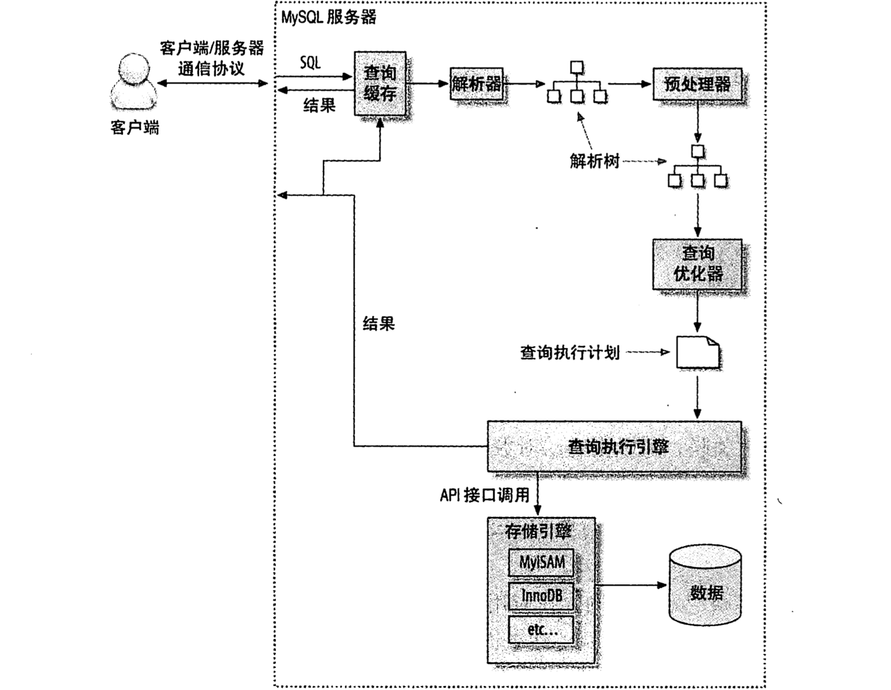
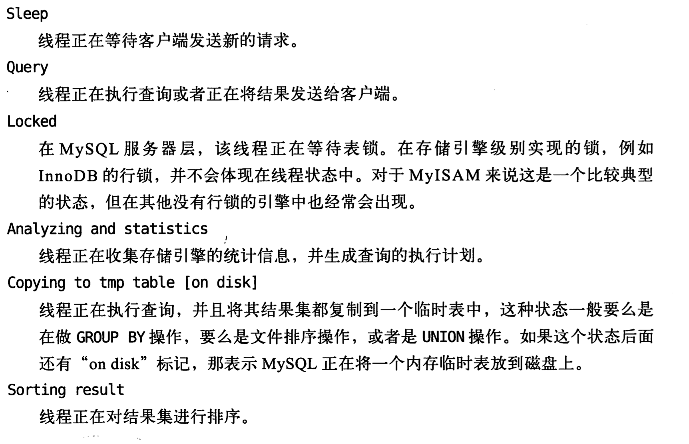

### 一个复杂的查询还是多个简单的查询
mysql 链接的断开和链接都是轻量级的
### 切分查询
每次处理要处理的一部分；
大的数据操作，锁多的数据；占满整个事务日志；消耗系统资源；阻塞很多小的但是重要的查询；
### 分解关联查询
将多表数据进行查询；然后在程序中对数据进行关联操作

### mysql 查询步骤

### 查询执行
mysql_query  将所有的值放在内存
mysql_unbuffered_query 逐条取数据

### 查看线程状态
show full processlist
state值：


### 查询缓存
Mysql 判断是否命中缓存的办法很简单，首先会将要缓存的结果放在引用表中，然后使用查询语句，数
据库名称，客户端协议的版本等因素算出一个hash值，这个hash值与引用表中的结果相关联。如果在执
行查询时，根据一些相关的条件算出的hash值能与引用表中的数据相关联，则表示查询命中
通过have_query_cache服务器系统变量指示查询缓存是否可用

如果使用查询缓存，在进行读写操作时会带来额外的资源消耗，消耗主要体现在以下几个方面
* 查询的时候会检查是否命中缓存，这个消耗相对较小
* 如果没有命中查询缓存，MYSQL会判断该查询是否可以被缓存，而且系统中还没有对应的缓
存，则会将其结果写入查询缓存
* 如果一个表被更改了，那么使用那个表的所有缓冲查询将不再有效，并且从缓冲区中移出。
这包括那些映射到改变了的表的使用MERGE表的查询。一个表可以被许多类型的语句更改，
例如INSERT、UPDATE、DELETE、TRUNCATE、ALTER TABLE、DROP TABLE或DROP DATABASE。

对于InnoDB而言，事物的一些特性还会限制查询缓存的使用。当在事物A中修改了B表时，因为在事物提交之前，对B表的修改对其他的事物而言是不可见的。为了保证缓存结果的正确性，InnoDB采取的措施让所有涉及到该B表的查询在事物A提交之前是不可缓存的。如果A事物长时间运行，会严重影响查询缓存的命中率

查询缓存的空间不要设置的太大。
```
因为查询缓存是靠一个全局锁操作保护的，如果查询缓存配置的内存比较大且里面存放了大量的查询结果
，当查询缓存失效的时候，会长时间的持有这个全局锁。因为查询缓存的命中检测操作以及缓存失效检测
也都依赖这个全局锁，所以可能会导致系统僵死的情况
```

SHOW VARIABLES LIKE 'have_query_cache';
###
###
###
###
###
###
###
###
###
###
###
###
