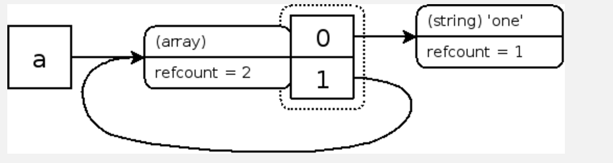
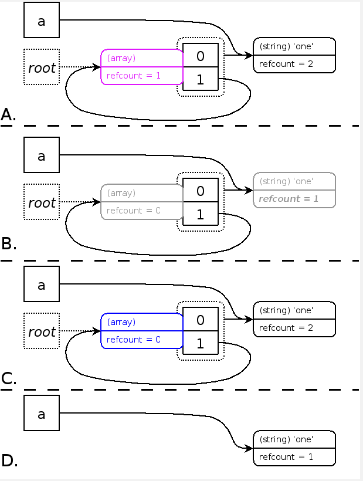

### 垃圾回收

#### HP5.3 之前（有内存泄漏）
```
在PHP5.3版本之前，PHP只有简单的基于引用计数的垃圾回收，当一个变量的引用计数变为0时， <br>
PHP将在内存中销毁这个变量，只是这里的垃圾并不能称之为垃圾。 <br>
并且PHP在一个生命周期结束后就会释放此进程/线程所占的内容，这种方式决定了PHP在前期不需要过多考虑内存的泄露问题。
```
##### 引用计数
每个php变量存在一个叫"zval"的变量容器中。
一个zval变量容器，除了包含变量的类型和值，还包括两个字节的额外信息。
* 第一个是"is_ref"，是个bool值，用来标识这个变量是否是属于引用集合(reference set)。【由于php允许用户
通过使用&来使用自定义引用】，zval变量容器中还有一个内部引用计数机制，来优化内存使用。
* 第二个额外字节是"refcount"，用以表示指向这个zval变量容器的变量(也称符号即symbol)个数。
所有的符号存在一个符号表中，其中每个符号都有作用域(scope)，那些主脚本(比如：通过浏览器请求的的脚本)和每个函数或者方法也都有作用域。


### EXAMPLE
```PHP
<?PHP
$a = "new string";
$b = $a;
xdebug_debug_zval( 'a' );
```
ECHO
```
a: (refcount=2, is_ref=0)='new string'
```
#### 失效
变量容器在”refcount“变成0时就被销毁. 当任何关联到某个变量容器的变量离开它的作用域(比如：函数执行结束)，或者对变量调用了函数 unset()时，”refcount“就会减1

```php
<?php
$a = array( 'one' );
$a[] =& $a;
xdebug_debug_zval( 'a' );
?>
```
echo
```
a: (refcount=2, is_ref=1)=array (
   0 => (refcount=1, is_ref=0)='one',
   1 => (refcount=2, is_ref=1)=...
)
```
##### 清理变量容器的问题
> 尽管不再有某个作用域中的任何符号指向这个结构(就是变量容器)，由于数组元素“1”仍然指向数组本身，所以这个容器
不能被清除 。
> 因为没有另外的符号指向它，用户没有办法清除这个结构，结果就会导致内存泄漏。庆幸的是，php将在脚本执行结束时
清除这个数据结构，但是在php清除之前，将耗费不少内存。

#### HP5.3 之后
```
首先，我们先要建立一些基本规则，如果一个引用计数增加，它将继续被使用，当然就不再在垃圾中。
如果引用计数减少到零，所在变量容器将被清除(free)。
就是说，仅仅在引用计数减少到非零值时，才会产生垃圾周期(garbage cycle)。
其次，在一个垃圾周期中，通过检查引用计数是否减1，并且检查哪些变量容器的引用次数是零，来发现哪部分是垃圾
```
### 新的计数方式
* 我们先要建立一些基本规则，如果一个引用计数增加，它将继续被使用，当然就不再在垃圾中。
* 如果引用计数减少到零，所在变量容器将被清除(free)。
    * 就是说，仅仅在引用计数减少到非零值时，才会产生垃圾周期(garbage cycle)。
    * 其次，在一个垃圾周期中，通过检查引用计数是否减1，并且检查哪些变量容器的引用次数是零，来发现
    哪部分是垃圾。

  

### 解析

* 的步骤 A：这个算法把所有可能根(possible roots 都是zval变量容器),放在根缓冲区(root buffer)中
(用紫色来标记，称为疑似垃圾)，这样可以同时确保每个可能的垃圾根(possible garbage root)在缓冲区中只出现一次。
仅仅在根缓冲区满了时，才对缓冲区内部所有不同的变量容器执行垃圾回收操作。

* 在步骤 B 中，模拟删除每个紫色变量。模拟删除时可能将不是紫色的普通变量引用数减"1"，
如果某个普通变量引用计数变成0了，就对这个`普通变量再做一次模拟删除`。每个变量只能被模拟删除一次，
模拟删除后标记为灰（原文说确保不会对同一个变量容器减两次"1",不对的吧）。

* 在步骤 C 中，模拟恢复每个紫色变量。恢复是有条件的，当变量的引用计数大于0时才对其做模拟恢复。
同样每个变量只能恢复一次，恢复后标记为黑，基本就是步骤 B 的逆运算。这样剩下的一堆没能恢复的就是该删除的蓝色节点了，在步骤 D 中遍历出来真的删除掉。

算法中都是模拟删除、模拟恢复、真的删除，都使用简单的遍历即可（最典型的深搜遍历）。复杂度为执行模拟操作的节点数正相关，不只是紫色的那些疑似垃圾变量。

### 使用
* PHP的垃圾回收机制是打开的，然后有个 php.ini 设置允许你修改它：zend.enable_gc 。
* 当垃圾回收机制打开时，每当根缓存区存满时，就会执行上面描述的循环查找算法。根缓存区有固定的大小，可存10,000个可能根
* 当缓冲区满的时候执行
