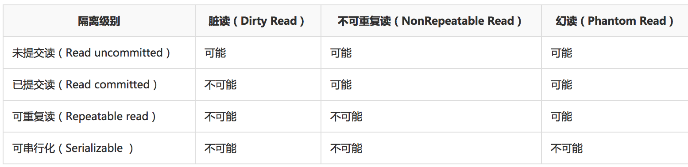

### 使用事务
```sql
> set autocommit = 0 禁止自动提交
> start transaction;
> update accout set money=money+100 where name="Jason";
> commit;
回滚事务
> set autocommit = 0 禁止自动提交
> start transaction;
> update account set money=money-100 where name="justin";
> rollback;
```

### 概念
数据库事务（Database Transaction）,是指作为 **单个逻辑工作单元执行的一系列操作** ，要么完全执行
，要么完全地不执行。

### 特性 ACID
###### 原子性（Atomicity）
原子性是指事务包含的所有操作要么全部成功，要么全部失败回滚。
###### 一致性（Consistency）
一致性是指事务必须使数据库从一个一致的状态变到另外一个一致的状态，也就是执行事务之前和之后的状态都必须处于一致的状态。在事务开始之前和事务结束以后，数据库的完整性约束没有被破坏
```
在事务T开始时，此时数据库有一种状态，这个状态是所有的MySQL对象处于一致的状态，例如数据库完整性约束
正确，日志状态一致等，当事务T提交后，这时数据库又有了一个新的状态，不同的数据，不同的索引，不同的日
志等，但此时，约束，数据，索引，日志等MySQL各种对象还是要保持一致性（正确性）。 这就是 从一个一致性
的状态，变到另一个一致性的状态。也就是事务执行后，并没有破坏数据库的完整性约束（一切都是对的）。知乎
```
###### 隔离性(Isolation)
隔离性是指当多个用户并发访问数据库时，比如操作同一张表时，数据库为每一个用户开启的事务，不能被其他事
务的操作所干扰，多个并发事务之间要相互隔离
```
即要达到这么一种效果：对于任意两个并发的事务T1和T2，在事务T1看来，T2要么在T1开始之前就已经结束，要
么在T1结束之后才开始，这样每个事务都感觉不到有其他事务在并发地执行。
```
###### 持久性(Durability)
持久性是指一个事务一旦被提交了，那么对于数据库中的数据改变就是永久性的，即便是在数据库系统遭遇到故障
的情况下也不会丢失提交事务的操作。


###mysql 事务类型
* 扁平事务；
* 带有保存点的扁平事务；
* 链事务；
* 嵌套事务；
* 分布式事务。

###### 扁平事务
```
扁平事务开发中使用的最多的一种事务。在这种事务中，所有操作都处于同一层次
扁平事务的主要缺点是不能提交或回滚事务的某一部分，或者分几个独立的步骤去提交。
BEGIN WORK
     Operation1:呼和浩特---火车--->北京
     Operation2:北京---飞机--->深圳
 ROLLBACK WORK
```

###### 带有保存点的扁平事务
```
这种事务除了支持扁平事务支持的操作外，允许在事务执行过程中回滚到同一事务中较早的一个状态，这是因为可
能某些事务在执行过程中出现的错误并不会对所有的操作都无效，放弃整个事务不合乎要求，开销也太大。保存点
用来通知系统应该记住事务当前的状态，以便以后发生错误时，事务能回到该状态。
```

###### 链事务
```
链事务，就是指回滚时，只能恢复到最近一个保存点；而带有保存点的扁平事务则可以回滚到任意正确的保存点。
```

###### 嵌套事务
```
BEGIN WORK
     SubTransaction1:
             BEGIN WORK
                 SubOperationX
             COMMIT WORK
     SubTransaction2:
             BEGIN WORK
                 SubOperationY
             COMMIT WORK
     ...
     SubTransactionN:
             BEGIN WORK
                 SubOperationN
             COMMIT WORK
 COMMIT WORK
 子事务既可以提交也可以回滚，但是它的提交操作并不马上生效，除非由其父事务提交。因此就可以确定，任何
 子事务都在顶层事务提交后才真正的被提交了。
```

### 事务控制语句
* BEGIN或START TRANSACTION；显示地开启一个事务；
* COMMIT；也可以使用COMMIT WORK，不过二者是等价的。COMMIT会提交事务，并使已对数据库进行的所有修改称为永久性的；
* ROLLBACK；有可以使用ROLLBACK WORK，不过二者是等价的。回滚会结束用户的事务，并撤销正在进行的所有未提交的修改；
* SAVEPOINT identifier；SAVEPOINT允许在事务中创建一个保存点，一个事务中可以有多个SAVEPOINT；
* RELEASE SAVEPOINT identifier；删除一个事务的保存点，当没有指定的保存点时，执行该语句会抛出一个异常；
* ROLLBACK TO identifier；把事务回滚到标记点；
* SET TRANSACTION；用来设置事务的隔离级别。InnoDB存储引擎提供事务的隔离级别有READ UNCOMMITTED、READ COMMITTED、REPEATABLE READ和SERIALIZABLE
### 隔离级别



### 事务隔离性及在MySQL中实践
当多个线程都开启事务操作数据库中数据时，数据库系统要能进行隔离操作
###### 脏读（Dirty Read）
一个事务处理过程里读取了另一个未提交的事务中的数据
###### 不可重复读（NonRepeatable Read）
对于数据库中的某个数据，一个事务范围内多次查询却返回了不同的数据值，这是由于在查询的间隔期间，另外一个事务修改并提交了该数据
```
 不可重复读和脏读的区别是，脏读是某一事务读取了另一个事务未提交的脏数据，而不可重复读则是读取了前一
事务提交的数据。
　　在某些情况下，不可重复读并不是问题，比如我们多次查询某个数据当然以最后查询得到的结果为主。但在另
一些情况下就有可能发生问题，例如对于同一个数据A和B依次查询就可能不同，A和B就可能打起来了……
```
　　
###### 幻读（Phantom Read）
在一个事务中读取到了别的事务插入的数据，导致前后不一致


### 来源网址
[险远的奇伟诡怪-简书](http://www.jianshu.com/p/bcc614524024)
[mysql事务类型](http://www.jellythink.com/archives/952)
