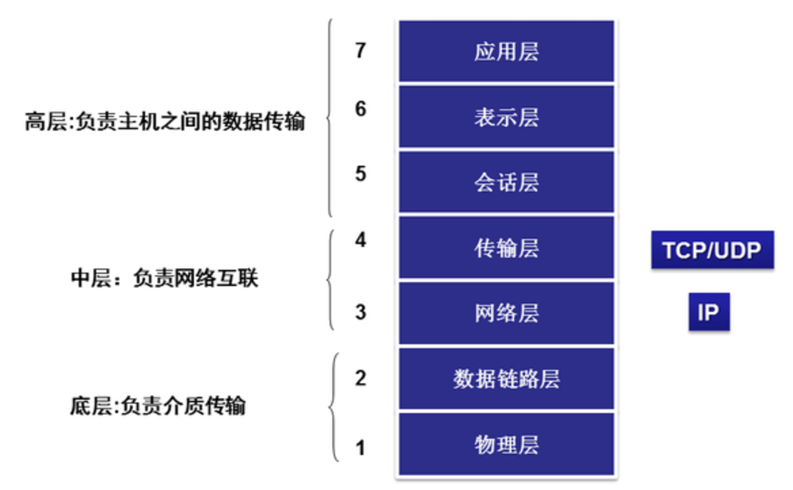
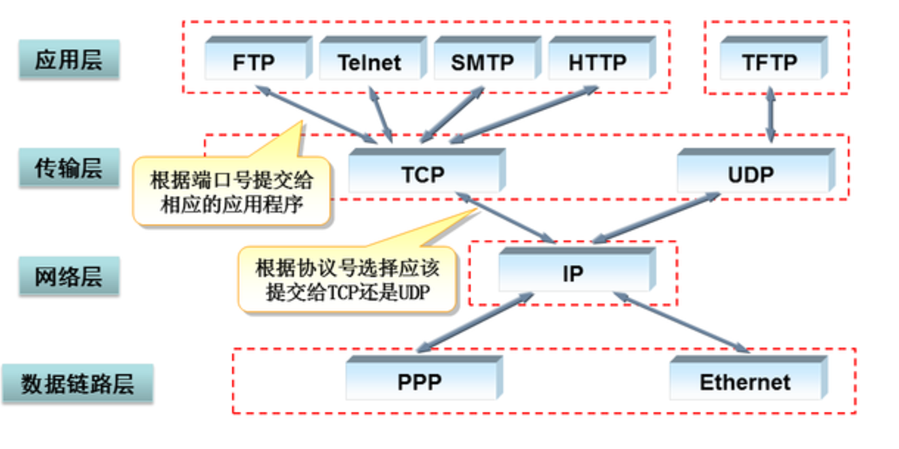

## HTTP
HTTP是一种 **通用的、无状态** 的 **应用层**  协议，适用于分布式、协同的、超媒体信息系统。通
过一些扩展（如请求方法、错误码、头信息），HTTP可用于超文本外的其他用途，例如命名服务器、分布式
对象管理。HTTP的特点在于数据表示的类型与协商，允许建立系统时不必考虑数据是如何传输的。

HTTP/1.1连接应该是 **持久连接**。这不仅能够减小TCP连接的内存、CPU开销，减小了TCP包的数量，
同时提供了更短的延迟和及时的错误反馈。此时，请求与应答可以形成管道而不必等上一个连接的关闭。


### 代理
是指转发代理，它接受URI请求，重写部分消息，然后把重写过的消息转发至URI标识的服务器。
### 网关
是指接收代理，它运行在其他服务器之上，需要时可以为背后的服务器翻译请求。
### 隧道
相当于两个连接的中转站，但不会改变消息。当通信需要通过一个中介时可以使用隧道，即使该中介不理解消息内容。


### 数据结构
* OSI 模型主要作为一个通用模型来做理论分析，
* TCP/IP 协议模型是互联网的实际通讯协议，两者一般做映射分析

##### OSI 整个模型层次大致可以分为3个主要层面来看
|.............主机...............|   操作系统和软件等  应用、表示话
|.............网络...............|   互联网络和相关协议  传输、网络（TCP/I）|.............介质...............|   物理介质相关            数据链路、物理

下图模型为OSI


* 应用层
```
与其它计算机进行通讯的一个应用，它是对应应用程序的通信服务的。
```
* 表示层/表达层
```
把数据转换为能与接收者的系统格式兼容并适合传输的格式;这一层的主要功能是定义数据格式及加密。
例如，
    FTP允许你选择以二进制或ASCII格式传输。
示例：
    加密，ASCII等
```
* 会话层
```
它定义了如何开始、控制和结束一个会话，包括对多个双向消息的控制和管理，以便在只完成连续消息的
一部分时可以通知应用，从而使表示层看到的数据是连续的，在某些情况下，如果表示层收到了所有的数
据，则用数据代表表示层。示例：RPC，SQL等
```
* 传输层
```
这层的功能包括是否选择差错恢复协议还是无差错恢复协议，及在同一主机上对不同应用的数据流的输入
进行复用，还包括对收到的顺序不对的数据包的重新排序功能。示例：TCP，UDP，SPX。
把传输表头（TH）加至数据以形成数据包。传输表头包含了所使用的协议等发送信息。例如：传输控制协
议义（TCP）等
```
* 网络层
```
决定数据的路径选择和转寄，将网络表头（NH）加至数据包，以形成分组。网络表头包含了网络数据。
例如：互联网协议（IP）等
```
* 数据链路层
```
负责网络寻址、错误侦测和改错。
当表头和表尾被加至数据包时，会形成了帧。
数据链表头（DLH）是包含了物理地址和错误侦测及改错的方法。
数据链表尾（DLT）是一串指示数据包末端的字符串。例如以太网、无线局域网（Wi-Fi）和通用分组无线服务（GPRS）等。
```
* 物理层
```
OSI的物理层规范是有关传输介质的特这些规范通常也参考了其他组织制定的标准。连接头、帧、帧的使
用、电流、编码及光调制等都属于各种物理层规范中的内容。物理层常用多个规范完成对所有细节的定义
。示例：Rj45，802.3等。
```


1，主机需要网络传输数据，网络本质上是一种服务，主机和网络之间靠传输层接口，就好比你要叫快递送东西；

2，网络可以提供两种服务：
1）可靠，面向连接；（TCP） 就像靠谱的快递，每一步都有反馈和监控，当然价格也是呵呵...
2）不可靠，尽力而为的传输 （UDP） 就像某些不靠谱的快递或者听都没听过的XX快递，价格低，但是能不能到就靠运气了。

3，两种服务无所谓好坏，TCP 的可靠是需要消耗很多资源的，效率低 （大块，重要的文件等）UDP 不保证可靠性，但是效率高（视频，语音，不重要的小文件等）

4，而其他的“HTTP、FTP、SMTP 等所谓的“Application-layer Protocol”协议”指的是在TCP/IP 通讯协议框架下具体实现特定功能的应用（HTTP 用来实现超文本传输，FTP文件传输，SMTP处理邮件等等），



