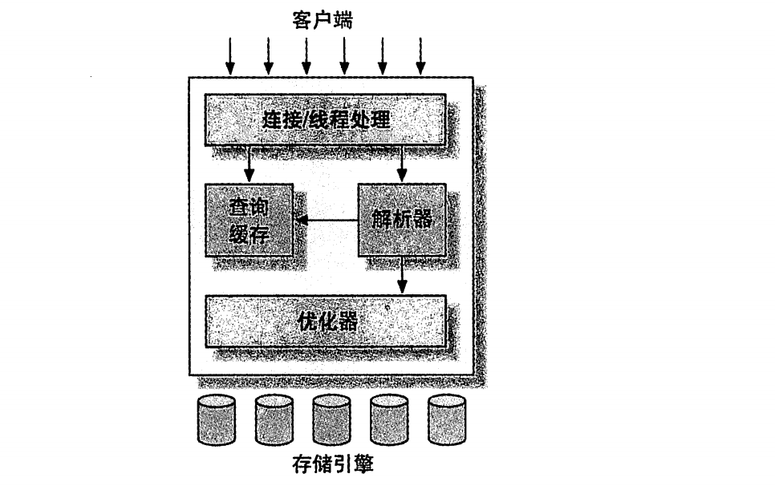

###  mysql 逻辑架构

第一层：链接处理、授权处理，安全等等

第二层：mysql的核心业务都在这一层；包括查询解析、分析、优化、缓存以及内存函数；所有的跨引擎的
的操作：存储过程，触发器，试图；

第三层：包含了存储引擎，包含了存储引擎对mysql的数据存储和提取；

### 链接安全
    每个客户端链接都会在服务器进程中拥有一个进程，这个链接的查询只会在单独的进程进行，该进程只
能轮训在某个cpu核心中进行
