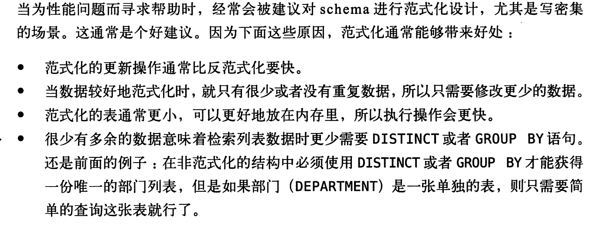

### 范式
```
范式是符合某一种级别的关系模式的集合。关系数据库中的关系必须满足一定的要求，即满足不同的范式。
目前关系数据库有六种范式.满足最低要求的范式是第一范式（1NF）
```

### 范式的原理
#### 第一范式：
1NF是对属性的 `原子性` 约束，要求属性具有原子性，`不可再分解`；
```
通俗的理解是字段还可以再分吗？如过不能，则是符合1NF的设计。

所谓第一范式（1NF）是指数据库表的每一列都是不可分割的基本数据项，同一列中不能有多个值，即实
体中的某个属性不能有多个值或者不能有重复的属性。如果出现重复的属性，就可能需要定义一个新的实
体，新的实体由重复的属性构成，新实体与原实体之间为一对多关系。在第一范式（1NF）中表的每一行
只包含一个实例的信息。简而言之，第一范式就是无重复的列。

说明：在任何一个关系数据库中，第一范式（1NF）是对关系模式的基本要求，不满足第一范式（1NF）
的数据库就不是关系数据库。
```

#### 第二范式：
2NF是对记录的`惟一性约束`，要求记录有惟一标识，即实体的惟一性；
```
简单的解释，比如你和一个女生约会建立一张表，不用每条约会记录都记录她的身高、体重，将身高体重
单独的存在一张表中供查询即可。

第二范式（2NF）要求数据库表中的每个实例或行必须可以被惟一地区分。为实现区分通常需要为表加上
一个列，以存储各个实例的惟一标识。
第二范式（2NF）要求实体的属性完全依赖于主关键字。
```
#### 第三范式：
3NF是对 `字段冗余性的约束`，即任何字段不能由其他字段派生出来，它要求字段没有冗余。
```
打个比方，比如评论表，如果你将用户ID，用户头像都放在这留言表中，就是不合适的了。用户头像是依
赖于用户ID，而不依赖该评论。
第三范式（3NF）要求一个数据库表中不包含已在其它表中已包含的非主关键字信息。
```

#### 优点



### 来源地址
http://kimi.it/418.html
